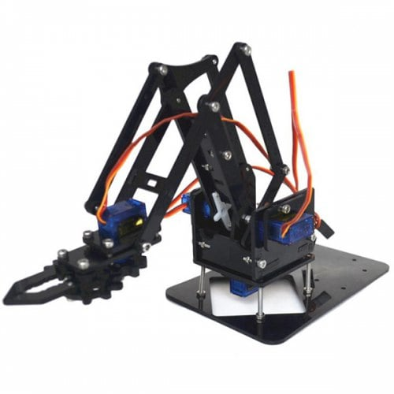

# Arduino Robot Claw from GearBest

## Introduction

The following repository provides an example of how to to to program the robot claw from Gearbest using the Arduino motherboard kit. I bought the full kit with the Arduino, Servos and Joysticks. Whilst the kit itself is actually pretty good, the supplier doesn't provide any code to program the Arduino. Despite asking them where one can find the code, they only reply with a link to the word doc / pdf for assembling the physical components. I've decided to publish my sketch in hope that it might help others who have bought this for Christmas or as a hobby project but need a little assistance.s

I bought the following kit:

- https://www.gearbest.com/novelty-toys/pp_009702220649.html?wid=1433363

I couldn't find a wiring diagram and as I was new to Arduino hacking I used https://www.circuito.io/ to help with understanding what was required to wire this up. I didn't use any of the generated code but it was a useful learning experience. I personally didn't need a voltage regulator as I had a 5v power source and only needed to use the components supplied.

I downloaded the Arduino IDE from https://www.arduino.cc/en/Main/Software. For those not familiar with coding / Arduino there are plenty of books & articles on the internet.

## Notes
- When assembled I have seen quite a lot of jitter on some of the servos, which seems to be caused by fluctuations on the joystick. See the println statements.
- I didn't need a voltage regulator / capacitor as suggested by circuito.io as I had a 5V power source.
- **BE CAREFUL** with the map() settings for the claw as I haven't yet perfected these and I've simply not go the time to finish the project off before Christmas (2018)
- The servo which provides lateral motion is un-balanced and would benefit from a counterweight.

## License
- Provided under MIT License - see [LICENSE](LICENSE)
